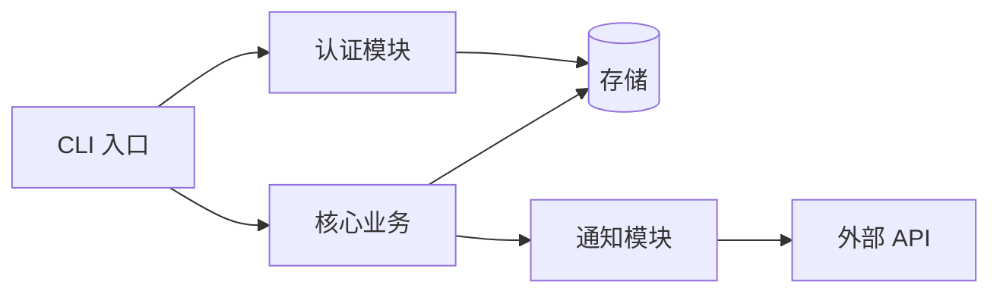
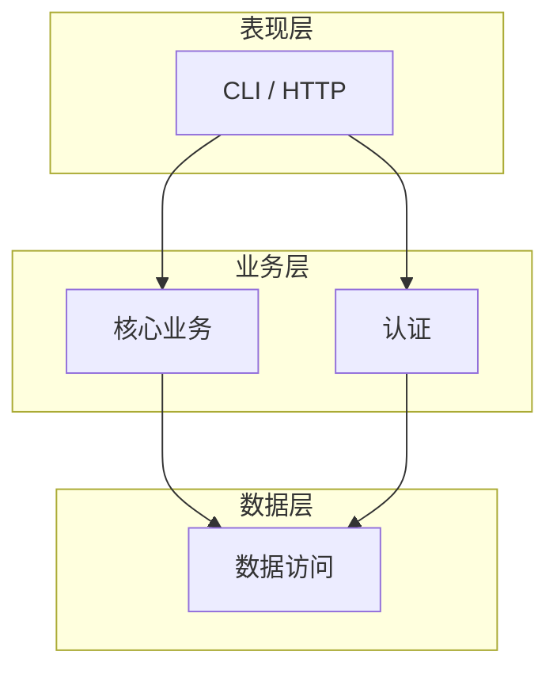

# 架构设计：写代码前必须先定架构

> 本篇是 [`01-AI协作开发方法论.md`](01-AI协作开发方法论.md) 第三步的展开。
> 核心论点：**让 AI 写代码之前，必须先让它产出设计文档、你审核通过后再写代码。** 否则 AI 每次会话都会重新设计架构，导致代码风格不一致。

---

## 0. 为什么写代码前必须先定架构

### 0.1 AI 协作特有的"风格漂移"问题

传统开发里，架构是资深工程师脑子里和几份文档里的共识，相对稳定。但 AI 协作开发不同：

- **AI 没有记忆**：每次新会话，AI 都是"新人"，它不知道上次为什么这么设计
- **AI 倾向于"重新设计"**：如果不约束，AI 会按它当下的判断重新组织代码，导致同一个项目里出现两三种风格
- **AI 会顺手重构**：为了实现新功能，AI 经常把旧模块"顺手优化"掉，破坏一致性

结果就是：**项目越写越乱，模块职责重叠，命名风格不一，最后谁都不敢动。**

### 0.2 架构文档的两个作用

1. **约束 AI**：写代码前先让 AI 读架构文档，它就知道"这个功能该放到哪个模块、用什么命名、遵循什么模式"
2. **稳定风格**：每次新会话都以架构文档为准，风格不会随会话漂移

> 💡 **一句话：架构文档是给 AI 的"代码宪法"。** 没有它，AI 每次都会重新立宪。

> ⚠️ **铁律：架构文档没定，不允许写一行业务代码。** 宁可花半天写设计文档，也不要让 AI 直接开干。

---

## 1. 三份必出的设计文档

📋 模板：[`../templates/02-架构设计.md`](../templates/02-架构设计.md)

### 1.1 架构设计文档

回答"系统由哪些模块组成、怎么协作"。

至少包含：

- **模块清单**：每个模块的名字 + 一句话职责（单一职责，不重叠）
- **调用关系**：谁调用谁、数据流向
- **依赖图**（用 mermaid，见 [§6](#6-依赖图怎么画mermaid-示例)）
- **目录结构**（见 [§3](#3-推荐的通用项目目录结构)）
- **命名规范**：文件、函数、变量、模块的命名约定
- **错误处理策略**：统一的错误传播 / 包装 / 日志规则

### 1.2 数据 / 存储设计文档

回答"项目自己的数据怎么存"。注意不是业务数据，而是**工具/应用自身的元数据**：

- 配置（用户偏好、特性开关）
- 状态（任务进度、上次运行时间）
- 历史 / 审计日志
- 缓存

每类数据要写清楚：

| 数据 | 存储介质 | 格式 | 生命周期 | 谁读写 |
|---|---|---|---|---|
| 配置 | 文件 / 环境变量 | YAML / TOML / .env | 持久 | 人写、程序读 |
| 状态 | 本地数据库 / 文件 | JSON / SQLite | 持久 | 程序读写 |
| 审计日志 | 文件 / 日志服务 | 结构化日志 | 按策略轮转 | 程序写、审计读 |

> ⚠️ **凭据绝不能存进这些数据里。** 密码 / token / key 用环境变量 / Vault / 加密配置，详见 [`06-安全与质量.md`](06-安全与质量.md)。

### 1.3 安全设计文档（涉及数据/权限/网络的项目必备）

不是所有项目都需要，但只要涉及以下任一项，就必须出安全设计文档：

- 用户数据 / 隐私
- 权限分级
- 网络 / 外部 API
- 生产环境访问
- 写操作 / 不可逆操作

至少包含：

- 认证与授权模型（谁能做什么）
- 凭据管理（存哪、怎么轮换）
- 最小权限原则（每个组件只给够用的权限）
- 危险操作的防护（Dry-run / 审批 / 白名单）
- 审计日志（who / when / what / result）

---

## 2. ADR（架构决策记录）

### 2.1 什么是 ADR

ADR（Architecture Decision Record）是用一小段结构化文本记录**为什么做了某个技术决策**。它解决的核心问题是：

> 三个月后（或下一个 AI 会话），没人记得"当时为什么选 A 不选 B"，于是有人（或 AI）提议推翻重来。

ADR 就是把决策的**背景和理由**固化下来，让后来者能判断"这个决策还成立吗"，而不是盲目推翻。

### 2.2 ADR 的格式

每条 ADR 用统一的简短格式：

```markdown
### ADR-001：决策标题（如"选用 SQLite 作为本地状态存储"）

- **状态**：已采纳 / 已废弃 / 已被 ADR-005 取代
- **背景**：为什么要做这个决策？遇到了什么问题？
- **决策**：选了什么？（一句话结论）
- **备选**：还考虑过什么？为什么没选？
- **后果**：这个决策带来的影响（正面 + 负面）
```

### 2.3 ADR 的用法

- **什么时候写**：每当做一个"不可轻易反悔"的技术决策（选型、定模式、定数据格式、定接口契约）时
- **放在哪**：单独的 `docs/decisions/` 目录，或并入交接文档的"关键技术决策"一节
- **编号递增**：ADR-001、ADR-002……不复用编号
- **状态流转**：被新决策取代时，旧 ADR 标记为"已被 ADR-XXX 取代"，**不要删除**（保留历史）

> 💡 **给 AI 用的关键技巧**：新会话开场让 AI 读一遍所有 ADR，它就能理解"为什么这么设计"，避免它推翻已有决策。这是防止 AI "重新立宪"的最有效手段之一。

### 2.4 什么时候该写 ADR（ vs 不用写）

| 该写 ADR | 不用写 |
|---|---|
| 选数据库 / 框架 / 通信协议 | 选某个工具函数的命名 |
| 定模块拆分方式 | 调整某行代码的缩进 |
| 定接口契约 / 数据格式 | 临时调试代码 |
| 改变已有的核心决策 | 纯实现细节 |

---

## 3. 推荐的通用项目目录结构

一套**项目无关**的骨架，复制即用。核心思想：**代码、文档、测试、配置、脚本各自隔离，AI 一眼就能找到该放哪。**

```
project-root/
├── src/                        # 源代码（按模块分子目录）
│   ├── module_a/               # 每个模块一个目录，单一职责
│   ├── module_b/
│   └── main                    # 入口（CLI / 服务启动 / 页面挂载）
├── docs/                       # 所有文档
│   ├── 00-立项书.md
│   ├── 01-PRD.md
│   ├── 02-架构设计.md
│   ├── 99-交接文档.md
│   └── decisions/              # ADR 存这里
│       └── ADR-001-xxx.md
├── tests/                      # 测试
│   ├── unit/                   # 纯逻辑测试，mock 掉外部依赖
│   ├── integration/            # 真实环境集成测试
│   ├── fixtures/               # 测试样本数据
│   └── golden/                 # 金标准输出（回归测试，防 AI 改坏）
├── config/                     # 配置文件（不含凭据！）
│   ├── default.yaml
│   └── production.yaml
├── scripts/                    # 运维 / 构建 / 部署脚本
│   ├── build.sh
│   ├── deploy.sh
│   └── seed.sh
├── AGENTS.md                   # 项目指令文件，AI 自动读取
├── README.md                   # 安装 + 使用说明
├── CHANGELOG.md                # 版本变更记录
└── .gitignore
```

### 3.1 各目录的职责边界

| 目录 | 放什么 | **不放什么** |
|---|---|---|
| `src/` | 业务代码 | 测试、文档、配置 |
| `docs/` | 所有 markdown 文档、ADR | 代码、可执行脚本 |
| `tests/` | 测试代码 + 测试数据 | 生产代码、真实凭据 |
| `config/` | 配置文件 | **凭据（用环境变量）** |
| `scripts/` | 一次性 / 运维脚本 | 被业务代码依赖的逻辑 |

> ⚠️ **最重要的边界**：`scripts/` 里的代码**不能被 `src/` 依赖**。脚本是一次性的，业务代码依赖脚本会导致部署混乱。

### 3.2 为什么要把 `docs/` 放在项目里（而不是 wiki）

- **和代码同仓库**：版本一致，AI 能直接读到对应版本的文档
- **AI 可访问**：AI 会话能直接 Read 这些文件，wiki 它够不着
- **可 diff**：文档变更走 PR review，不会偷偷改

---

## 4. 模块划分原则

### 4.1 三大原则

| 原则 | 含义 | 反面教材 |
|---|---|---|
| **单一职责** | 一个模块只做一类事 | "utils" 里什么都塞（认证、格式化、IO 混一起） |
| **统一接口** | 模块对外暴露的调用方式一致 | 有的模块返回 Promise、有的回调、有的抛异常 |
| **可测试** | 模块能脱离外部依赖单独测试 | 业务逻辑和数据库 / 网络 / 文件 IO 耦死 |

### 4.2 单一职责的实操判断

问自己两个问题：

1. **"这个模块的一句话职责是什么？"** —— 写不出来，说明它职责不清
2. **"改动 X 需求，会动几个模块？"** —— 如果一个简单改动要动 3 个以上模块，说明模块划分有问题

### 4.3 统一接口的实操要点

在架构文档里钉死这些约定，让所有模块遵守：

- **返回值约定**：成功返回数据，失败怎么办？（返回错误对象 / 抛特定异常 / 返回 null？全项目统一）
- **入参约定**：用对象 / 位置参数？必填字段怎么标记？
- **命名约定**：动词在前还是名词在前？驼峰还是下划线？
- **错误类型**：定义一套统一的错误码 / 错误类型体系

> 💡 AI 最容易在这里"自由发挥"。如果不钉死，AI 会在不同模块里用不同风格，后期统一成本极高。

### 4.4 可测试的实操要点

核心：**业务逻辑和副作用分离。**

- 把"纯计算"（给定输入得到输出，无副作用）放到独立模块，这类模块 100% 可单测
- 把"副作用"（数据库、网络、文件、时间）作为依赖注入进去，测试时 mock 掉
- 入口层（CLI / HTTP handler）尽量薄，只做"解析输入 → 调用核心 → 格式化输出"

---

## 5. 依赖图怎么画（mermaid 示例）

依赖图是架构文档里最直观的一块。用 mermaid 画，AI 和人都能直接看懂。

### 5.1 模块依赖图（`graph LR`）

展示模块间的调用 / 依赖关系。**箭头方向 = "依赖于"**。



### 5.2 分层架构图（`graph TB`）

展示纵向分层，每层只依赖下层。



### 5.3 画依赖图的规则

- **箭头 = 依赖**：A → B 表示 A 依赖 B
- **避免环**：依赖关系必须是 DAG（有向无环图），出现环说明模块耦合，要拆
- **标出外部依赖**：数据库、外部 API、文件系统用不同形状（如 `[(数据库)]`）区分
- **粒度适中**：画到模块级，不要画到函数级（太细反而看不懂）

> ⚠️ **检查依赖图的健康度**：
> - 有没有"上帝模块"（所有箭头都指向它 / 它指向所有）？→ 该拆
> - 有没有环？→ 必须消除
> - 有没有模块依赖了它不该依赖的层（如数据层反过来依赖表现层）？→ 违反分层

---

## 6. 让 AI 产出架构文档的正确姿势

不要直接说"帮我设计架构"。要分步骤引导：

```markdown
请基于 docs/00-立项书.md 和 docs/01-PRD.md，产出架构设计文档，要求：

1. 先列出模块清单（每个模块一句话职责，单一职责）
2. 画出模块依赖图（用 mermaid）
3. 定目录结构（遵循 src/docs/tests/config/scripts 分离）
4. 定命名规范和接口约定（返回值、错误处理统一）
5. 对每个关键技术决策写一条 ADR

约束：
- 不要写任何业务代码
- 不确定的地方标注 [待确认]
- 输出到 docs/02-架构设计.md
```

产出后**人工审核**，重点看：

- [ ] 模块职责有没有重叠
- [ ] 依赖图有没有环 / 上帝模块
- [ ] 命名规范是否明确
- [ ] 危险操作有没有对应的安全设计
- [ ] ADR 是否覆盖了关键决策

审核通过后，再让 AI 开始写代码。

---

## 7. 小结与检查清单

架构设计阶段做完后，逐项打勾：

- [ ] 架构设计文档（模块清单 + 依赖图 + 目录结构 + 命名规范）
- [ ] 数据 / 存储设计文档（每类数据的存储 / 格式 / 生命周期）
- [ ] 安全设计文档（如涉及数据/权限/网络）
- [ ] 关键决策都写了 ADR（背景 / 决策 / 备选 / 后果）
- [ ] 目录结构遵循 src/docs/tests/config/scripts 分离
- [ ] 模块满足单一职责、统一接口、可测试
- [ ] 依赖图无环、无上帝模块
- [ ] AGENTS.md 已指向架构文档，AI 会自动读

> 🎯 **验收标准**：把架构文档发给一个新的 AI 会话，让它实现一个新功能点，看它把代码放到了正确的模块、用了正确的命名、遵守了接口约定。如果是，架构文档就合格了。

---

## 相关文档

- 总纲：[`01-AI协作开发方法论.md`](01-AI协作开发方法论.md)
- 上一步：[`02-立项与需求.md`](02-立项与需求.md)
- 下一步：[`04-AI会话技巧.md`](04-AI会话技巧.md)
- 模板：[`../templates/02-架构设计.md`](../templates/02-架构设计.md)
