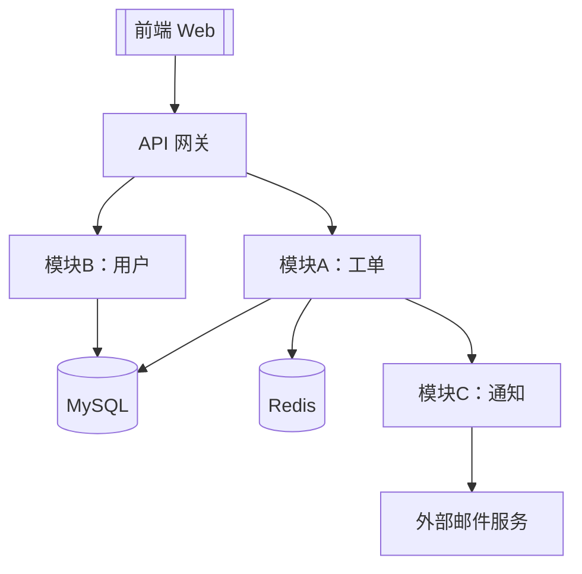
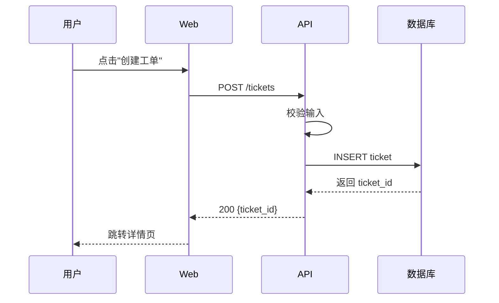

<!--
用途：架构设计文档模板。
      在 PRD（01-PRD.md）定稿后，用它把"模块怎么分、谁依赖谁、关键技术决策为什么这么定"写下来。
      使用方法：复制到新项目，填好"项目一句话架构"和目录结构，补全模块职责表、依赖图、ADR。
      核心原则：每个模块职责单一、边界清晰；每个关键技术决策都有一条 ADR 记录"为什么"。
-->

# [项目名] 架构设计文档

> 版本：v0.1　　作者：[姓名]　　日期：[YYYY-MM-DD]　　状态：[草案 / 评审中 / 已定稿]
>
> 关联文档：[00-立项书.md](./00-立项书.md)　｜　[01-PRD.md](./01-PRD.md)

---

## 一、项目一句话架构

<!-- 用一句话概括技术架构与核心思路，让任何人 10 秒内 get 到。 -->
<!-- 例："采用 Go + React 的单体应用，按 DDD 分层，MySQL 存储，Redis 缓存，Docker Compose 部署。" -->

**[一句话架构]**

---

## 二、技术栈选型

| 层次 | 选型 | 版本 | 选型理由（一句话） |
|------|------|------|--------------------|
| 前端 | [React/Vue] | [版本] | [理由] |
| 后端 | [Go/Node/Java] | [版本] | [理由] |
| 数据库 | [MySQL/PostgreSQL] | [版本] | [理由] |
| 缓存 | [Redis] | [版本] | [理由] |
| 消息队列 | [Kafka/RabbitMQ/无] | [版本] | [理由] |
| 部署 | [Docker/K8s] | [版本] | [理由] |

---

## 三、模块划分（目录结构）

<!-- 把项目的目录结构贴出来，标注每个目录的职责。这是 AI 理解项目骨架的关键。 -->

```
[项目名]/
├── docs/                  # 文档（立项书/PRD/架构/交接）
├── [前端目录]/            # 前端代码
│   ├── src/
│   │   ├── components/    # 通用组件
│   │   ├── pages/         # 页面
│   │   ├── services/      # 接口调用
│   │   └── utils/         # 工具函数
│   └── package.json
├── [后端目录]/            # 后端代码
│   ├── cmd/               # 启动入口
│   ├── internal/          # 内部业务（不对外暴露）
│   │   ├── [模块A]/       # 模块 A：[职责]
│   │   ├── [模块B]/       # 模块 B：[职责]
│   │   └── [模块C]/       # 模块 C：[职责]
│   ├── pkg/               # 可复用的公共包
│   ├── migrations/        # 数据库迁移脚本
│   └── go.mod
├── scripts/               # 运维脚本
├── docker-compose.yml
└── README.md
```

---

## 四、模块职责表

<!-- 一个模块只做一件事。如果发现某模块职责跨多个领域，应拆分。 -->

| 模块名 | 路径 | 职责（一句话） | 对外接口 | 依赖的其他模块 |
|--------|------|----------------|----------|------------------|
| [模块A] | [internal/模块A] | [例如"工单的增删改查"] | [API/函数] | [模块B, 模块C] |
| [模块B] | [internal/模块B] | [例如"用户鉴权"] | [API/函数] | [无] |
| [模块C] | [internal/模块C] | [例如"通知发送"] | [API/函数] | [模块B] |

**模块设计原则**：
- 单一职责：一个模块只做一件事
- 依赖单向：避免循环依赖（A→B，则 B 不能再依赖 A）
- 接口稳定：模块对外接口尽量不变，内部实现可自由重构

---

## 五、依赖关系

<!-- 用 mermaid 画出模块/服务间的依赖关系图。AI 与开发者靠这张图理解系统拓扑。 -->



> 说明：替换为真实模块名。箭头方向表示"依赖于"。避免出现环。

---

## 六、数据流



---

## 七、关键设计决策（ADR）

<!-- ADR = Architecture Decision Record 架构决策记录。每个重要技术决策都该有一条，记录"为什么这么选"。 -->
<!-- 保留 3-5 条骨架，按需补充。决策一旦记录不要删除，过时的标注为"已废弃"。 -->

### ADR-001：[决策标题，例如"选择 MySQL 而非 PostgreSQL"]

- **状态**：[已采纳 / 已废弃 / 已替代]
- **日期**：[YYYY-MM-DD]
- **背景**：[为什么需要这个决策？面临什么问题/选择？]
- **决策**：[最终选择了什么？]
- **理由**：[为什么这么选？对比了哪些方案？]
- **代价/权衡**：[这个选择的代价是什么？牺牲了什么？]
- **相关文档**：[链接]

### ADR-002：[决策标题，例如"采用单体而非微服务"]

- **状态**：[已采纳 / 已废弃 / 已替代]
- **日期**：[YYYY-MM-DD]
- **背景**：[背景说明]
- **决策**：[决策内容]
- **理由**：[理由]
- **代价/权衡**：[代价]
- **相关文档**：[链接]

### ADR-003：[决策标题，例如"鉴权方案选择 JWT + Redis 黑名单"]

- **状态**：[已采纳 / 已废弃 / 已替代]
- **日期**：[YYYY-MM-DD]
- **背景**：[背景说明]
- **决策**：[决策内容]
- **理由**：[理由]
- **代价/权衡**：[代价]
- **相关文档**：[链接]

### ADR-004：[TODO 决策标题]

- **状态**：[待补充]
- **日期**：[TODO]
- **背景**：[TODO]
- **决策**：[TODO]
- **理由**：[TODO]

### ADR-005：[TODO 决策标题]

- **状态**：[待补充]
- **日期**：[TODO]
- **背景**：[TODO]
- **决策**：[TODO]
- **理由**：[TODO]

---

## 八、横切关注点

| 关注点 | 方案 | 说明 |
|--------|------|------|
| 日志 | [方案，例如"zap + 文件轮转"] | [格式：JSON，级别分级] |
| 监控 | [方案，例如"Prometheus + Grafana"] | [关键指标：QPS/延迟/错误率] |
| 告警 | [方案，例如"钉钉机器人"] | [阈值：P95>1s 持续 5min] |
| 配置 | [方案，例如"环境变量 + .env"] | [敏感配置不入库] |
| 鉴权 | [方案，例如"JWT"] | [说明] |
| 错误处理 | [方案，例如"统一错误码"] | [错误码规范链接] |

---

## 附：变更记录

| 日期 | 版本 | 变更内容 | 变更人 |
|------|------|----------|--------|
| [YYYY-MM-DD] | v0.1 | 初稿 | [姓名] |
